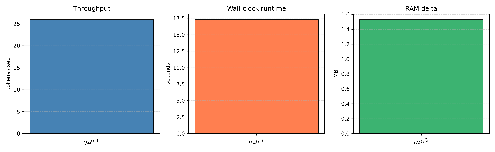
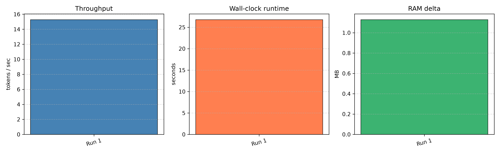

# salareen-ex05: Running a Massive LLM Locally

**AI Agents Architecture — Homework 05**
**Group:** salareen | **Students:** Saleh Hammam, Areen Tarabeh

> **Status: Experiment in progress — results not yet collected.**
> This README serves as both the project guide and the final technical report skeleton.
> Sections marked *[PENDING]* will be filled with real measurements after experiments run.

---

## Table of Contents

1. [Project Overview](#1-project-overview)
2. [Hardware Summary](#2-hardware-summary)
3. [Model-Selection Strategy](#3-model-selection-strategy)
4. [Experiment Plan](#4-experiment-plan)
5. [Metrics Plan](#5-metrics-plan)
6. [Economic Analysis Plan](#6-economic-analysis-plan)
7. [Lecture Concepts Connection](#7-lecture-concepts-connection)
8. [Results](#8-results) *(PENDING)*
9. [Project Structure](#9-project-structure)
10. [Setup Instructions](#10-setup-instructions)
11. [Running the Experiments](#11-running-the-experiments)
12. [References](#12-references)

---

## 1. Project Overview

This project investigates the practical feasibility of running a large language model (LLM) on
consumer-grade CPU-only hardware. The experiment chain is:

1. **Hardware audit** — detect and record the actual machine capabilities.
2. **Baseline inference** — attempt direct local inference with a small/medium model using
   `transformers` and measure raw latency and memory.
3. **Optimization** — apply quantization (GGUF/llama.cpp, or GPTQ/AWQ if supported) and/or
   AirLLM's layer-streaming technique to reduce peak memory and compare performance.
4. **Economic analysis** — compare the cost of local CPU inference against paid API access
   (Anthropic Claude, OpenAI GPT-4o) for typical workloads.
5. **Report** — draw conclusions about when on-prem inference is viable vs. when API is
   more cost-effective.

---

## 2. Hardware Summary

| Component | Detail |
|-----------|--------|
| CPU | Intel Core i7-8550U @ 1.80 GHz (Boost ~4.0 GHz) |
| Physical cores | 4 |
| Logical processors | 8 (Hyper-Threading) |
| RAM | ~16 GB DDR4 |
| RAM available at test start | ~6.8 GB |
| GPU | Intel UHD Graphics 620 (integrated) |
| GPU VRAM | ~1 GB shared system RAM |
| CUDA / NVIDIA | **Not available** (`nvidia-smi` not recognized) |
| Disk (C:) | ~511 GB total, ~22.5 GB free |
| OS | Windows 11 Home |

**Key constraint:** CPU-only inference. No CUDA, no discrete GPU. All tensor operations
run on the i7-8550U. Peak addressable RAM for a model is constrained to the free physical
RAM (~6.8 GB at start) minus OS overhead; larger models will require virtual memory/paging
or a layer-streaming strategy such as AirLLM.

---

## 3. Model-Selection Strategy

Because this is a CPU-only environment with ~6–8 GB usable RAM, model size must be
chosen carefully:

| Strategy | Candidate family | Notes |
|----------|-----------------|-------|
| FP16 baseline | Models ≤ 3B params (≤ ~6 GB FP16) | Likely fits in RAM; establishes baseline |
| INT8 quantization | Same model, 8-bit | Halves memory; tests quantization impact |
| GGUF / llama.cpp | Any GGUF-quantized model (Q4_K_M etc.) | CPU-optimized; best latency on CPU |
| AirLLM | Larger model (7B+) with layer streaming | Tests feasibility under disk paging |
| Fallback | Smaller GGUF model if 7B is too slow | Documented with justification |

Final model choice will be logged after the hardware detection script runs and confirms
available RAM. Candidate model families: Phi-3-mini, Qwen2-0.5B/1.5B, TinyLlama, Mistral-7B.

---

## 4. Experiment Plan

### Phase A — Baseline
- Load a small model (FP16 / BF16) directly with `transformers`.
- Generate a fixed prompt (100-token output target).
- Record TTFT, TPOT, tokens/sec, peak RAM.

### Phase B — Quantization
- Apply INT8 quantization via `bitsandbytes` (if supported on CPU) **or** convert to GGUF
  and run via `llama-cpp-python`.
- Same prompt, same measurement harness.
- Compare delta vs. Phase A.

### Phase C — AirLLM
- Attempt AirLLM's `AutoModel` with `init_on_disk=True` on a 7B model.
- Measure layer-load overhead, peak RAM, total throughput.
- **Important hardware caveat:** On this CPU-only machine (no NVMe, ~6.8 GB free RAM,
  spinning or SATA SSD), AirLLM may be extremely slow (minutes per token) or fail
  entirely due to Windows disk-I/O bottlenecks during layer streaming.
  A carefully documented failure or fallback is a fully valid scientific outcome —
  it demonstrates *why* AirLLM requires fast NVMe storage and adequate RAM headroom,
  which is itself a core lesson of this assignment.
- If AirLLM is not feasible, fall back to the best GGUF result and analyze the failure.

### Phase D — Economic Analysis
- Assume a representative workload: 1 M tokens/month input, 200 K tokens/month output.
- Compute API cost (Anthropic Claude 3 Haiku, OpenAI GPT-4o-mini).
- Compute on-prem cost (electricity, hardware amortisation).
- Determine break-even point.

---

## 5. Metrics Plan

All metrics will be captured by `src/salareen_ex05/metrics.py`.

| Metric | Description | Unit |
|--------|-------------|------|
| TTFT | Time from prompt submission to first output token | seconds |
| TPOT | Average time between consecutive output tokens | seconds/token |
| Throughput | Output tokens generated per second | tokens/sec |
| Peak RAM | Maximum RSS during generation | MB |
| Total runtime | Wall-clock time for entire run | seconds |
| Output quality | Manual rating + perplexity proxy if available | qualitative |

---

## 6. Economic Analysis Plan

See `src/salareen_ex05/costs.py` for the computation model.

Assumptions (to be refined with real latency data):
- Hardware amortisation: 3-year straight-line depreciation on purchase price
- Electricity: ~0.12 USD/kWh, TDP ~15 W for i7-8550U under load
- API pricing: current public pricing at time of experiment
- Workload: 1 M input tokens + 200 K output tokens per month

Expected deliverable: break-even analysis table and chart showing at which monthly
token volume on-prem becomes cheaper than API.

---

## 7. Lecture Concepts Connection

| Concept | Where it appears in this experiment |
|---------|-------------------------------------|
| CPU vs GPU | All inference is CPU-only; we measure the cost of no-GPU execution |
| VRAM / RAM | RAM is the binding constraint; model must fit or be streamed |
| Prefill vs Decode | Measured separately: TTFT captures prefill, TPOT captures decode |
| Memory-bound vs Compute-bound | CPU inference is almost entirely memory-bandwidth-bound |
| Virtual memory / paging / mmap | AirLLM uses mmap to stream layers; Windows page file may be hit |
| Quantization | INT8 / Q4 reduce memory footprint; we measure accuracy/speed tradeoff |
| AirLLM | Layer-by-layer loading avoids full-model RAM allocation |
| SafeTensors / GGUF | Model format determines load strategy; GGUF preferred for CPU |

---

## 8. Results

### Baseline 1: Ollama — qwen2.5:0.5b (CPU-only)

First real inference result collected on the target hardware using the Ollama HTTP API
(`http://localhost:11434/api/generate`), model `qwen2.5:0.5b`, with the fixed benchmark
prompt stored in `data/prompts/ollama_benchmark_prompt.txt`.

| Metric | Value |
|--------|-------|
| Model | qwen2.5:0.5b (0.5B parameters) |
| Total wall-clock runtime | 17.31 s |
| Prompt tokens (prompt_eval_count) | 79 |
| Prompt eval duration | 107,959,000 ns (≈ 108 ms) |
| Output tokens (eval_count) | 270 |
| Eval (decode) duration | 10,389,355,000 ns (≈ 10.39 s) |
| **Throughput** | **25.99 tokens/sec** |
| Process RSS before (script only) | 38.44 MB |
| Process RSS after (script only) | 39.97 MB |
| Process RSS delta | 1.53 MB |

> **RAM note:** The RSS values above reflect only the benchmark script process.
> The Ollama server and model weights run in a separate process; total system
> memory for the model should be measured from the Ollama process directly
> (planned for a later phase).



#### Interpretation

- **Local CPU-only inference is feasible for a very small 0.5B model.** At ~26 tokens/sec
  the output is readable in near real-time on consumer hardware with no GPU.
- **This is a functional baseline, not a proof that larger models will work.** qwen2.5:0.5b
  is far smaller than the "massive LLM" target of this experiment; a 7B model would require
  roughly 14× more memory and would be correspondingly slower on CPU.
- **Prefill vs. decode split is visible:** the 79 prompt tokens were evaluated in ~108 ms
  (≈ 732 tokens/sec — fast, parallelisable prefill), while the 270 decode tokens took
  ~10.4 s total (≈ 26 tokens/sec — slow, sequential decode). This directly illustrates the
  prefill/decode asymmetry discussed in the lecture.
- **Next phases** will apply quantization, attempt AirLLM layer-streaming on a larger
  model, and produce an economic break-even analysis.

---

### Baseline 2: Ollama — qwen2.5:1.5b (CPU-only)

Second inference result, same hardware, same fixed prompt, model scaled up to 1.5B parameters.

| Metric | Value |
|--------|-------|
| Model | qwen2.5:1.5b (1.5B parameters) |
| Total wall-clock runtime | 26.77 s |
| Prompt tokens (prompt_eval_count) | 79 |
| Prompt eval duration | 1,446,900,000 ns (≈ 1.45 s) |
| Output tokens (eval_count) | 295 |
| Eval (decode) duration | 19,308,239,000 ns (≈ 19.31 s) |
| **Throughput** | **15.28 tokens/sec** |
| Process RSS before (script only) | 38.30 MB |
| Process RSS after (script only) | 39.43 MB |
| Process RSS delta | 1.13 MB |

> **RAM note:** RSS values reflect the benchmark script process only, not the Ollama
> server or model weights. System-level Ollama memory measurement is planned for a
> later phase.



---

### Cross-model Comparison

| Model | Runtime (s) | Prompt tokens | Output tokens | Throughput (tok/s) | Script RSS delta (MB) |
|-------|-------------|---------------|---------------|--------------------|-----------------------|
| qwen2.5:0.5b | 17.31 | 79 | 270 | **25.99** | 1.53 |
| qwen2.5:1.5b | 26.77 | 79 | 295 | **15.28** | 1.13 |
| Throughput ratio | — | — | — | 0.59× (1.5b / 0.5b) | — |

#### Analysis

- **Throughput dropped from ~26.0 to ~15.3 tok/s (−41%) as model size tripled from
  0.5B to 1.5B.** This is consistent with a memory-bandwidth-bound workload: a larger
  model has proportionally more weight data that must be streamed through the CPU cache
  on every decode step.
- **Runtime increased from 17.3 s to 26.8 s (+55%)** for a similar output length,
  confirming that the decode phase scales roughly linearly with model size on CPU.
- **Prefill cost is more sensitive to model size than decode throughput alone:**
  prompt eval duration grew from ~108 ms (0.5B) to ~1,450 ms (1.5B) — a 13× increase
  for only a 3× parameter increase, suggesting additional memory-allocation overhead
  at first load.
- **Both models are still far smaller than the "massive LLM" target.** A 7B model at
  this scaling trend would project to roughly 4–6 tok/s on this hardware, making
  interactive use marginal. The next phase must quantify this with either a direct
  7B test, a GGUF-quantized model, or AirLLM layer-streaming.
- **Script-level RSS deltas are small and similar across both runs.** This confirms
  that the benchmark wrapper itself has negligible memory overhead; the real model
  footprint lives in the Ollama server process.

---

> **Still pending:** larger model / quantization experiment, AirLLM / fallback,
> system-level Ollama memory tracking, economic analysis, comparative charts across
> all phases, and final PDF report.

---

## 9. Project Structure

```
salareen-ex05/
├── README.md                  # This file — report skeleton
├── pyproject.toml             # Project metadata & dependencies (uv)
├── .env-example               # Environment variable template
├── docs/
│   ├── PRD.md                 # Product Requirements Document
│   ├── PLAN.md                # Technical architecture & experiment plan
│   ├── TODO.md                # Phase-by-phase task tracker
│   └── PROMPT_LOG.md          # Log of all AI prompts used
├── src/
│   └── salareen_ex05/
│       ├── __init__.py
│       ├── hardware.py        # Hardware detection utilities
│       ├── metrics.py         # Timing & memory measurement harness
│       ├── costs.py           # On-prem vs API economic model
│       ├── plots.py           # Matplotlib chart generators
│       └── main.py            # CLI entry point (typer)
├── experiments/               # Experiment runner scripts
├── results/                   # Raw JSON/CSV results (git-ignored if large)
├── reports/                   # Generated PDF/HTML reports
├── figures/                   # Saved chart images
├── data/                      # Prompts, reference answers, etc.
├── scripts/                   # One-off helper scripts
└── tests/
    ├── __init__.py
    ├── test_project_structure.py
    └── test_metrics.py
```

---

## 10. Setup Instructions

### Prerequisites
- Windows 11, Python 3.11 (recommended), `uv` installed globally
- At least 8 GB free disk space for model weights

### Steps

```powershell
# 1. Clone the repository (already done if you're reading this)
git clone https://github.com/SalehHammam25/salareen-ex05.git
cd salareen-ex05

# 2. Install uv (if not already installed)
powershell -ExecutionPolicy ByPass -c "irm https://astral.sh/uv/install.ps1 | iex"

# 3. Create virtual environment and install all dependencies in one step
uv sync

# 4. Copy environment template
copy .env-example .env
# Edit .env if needed (Hugging Face token for gated models, etc.)

# 5. Verify setup — uv run uses the managed venv automatically
uv run python -m salareen_ex05.main --help
```

---

## 11. Running the Experiments

```powershell
# Hardware detection
uv run python -m salareen_ex05.main hardware

# Ollama benchmark (requires Ollama running with qwen2.5:0.5b pulled)
uv run python -m salareen_ex05.main ollama-benchmark --model qwen2.5:0.5b --runs 1

# Multiple runs for stable averages
uv run python -m salareen_ex05.main ollama-benchmark --model qwen2.5:0.5b --runs 3

# Baseline inference (model TBD after hardware check)
uv run python -m salareen_ex05.main run baseline --model <model-id> --max-tokens 100

# Quantized inference
uv run python -m salareen_ex05.main run gguf --model <model-id>

# AirLLM inference
uv run python -m salareen_ex05.main run airllm --model <model-id>

# Economic analysis
uv run python -m salareen_ex05.main costs --monthly-input-tokens 1000000 --monthly-output-tokens 200000

# Generate benchmark summary chart from a CSV results file
uv run python -m salareen_ex05.main plots --results-file results/ollama_benchmark_qwen2_5_0_5b.csv

# Also works with JSON
uv run python -m salareen_ex05.main plots --results-file results/ollama_benchmark_qwen2_5_0_5b.json
```

---

## 12. References

- AirLLM GitHub: https://github.com/lyogavin/airllm
- llama.cpp: https://github.com/ggerganov/llama.cpp
- Hugging Face `transformers`: https://huggingface.co/docs/transformers
- `llama-cpp-python`: https://github.com/abetlen/llama-cpp-python
- Anthropic Claude pricing: https://www.anthropic.com/pricing
- OpenAI pricing: https://openai.com/pricing
