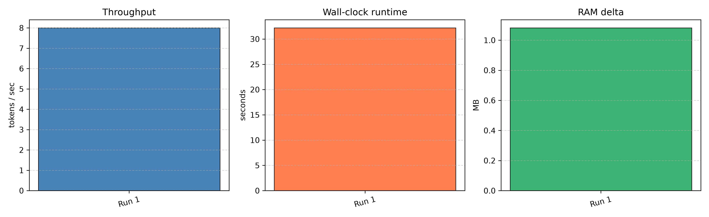
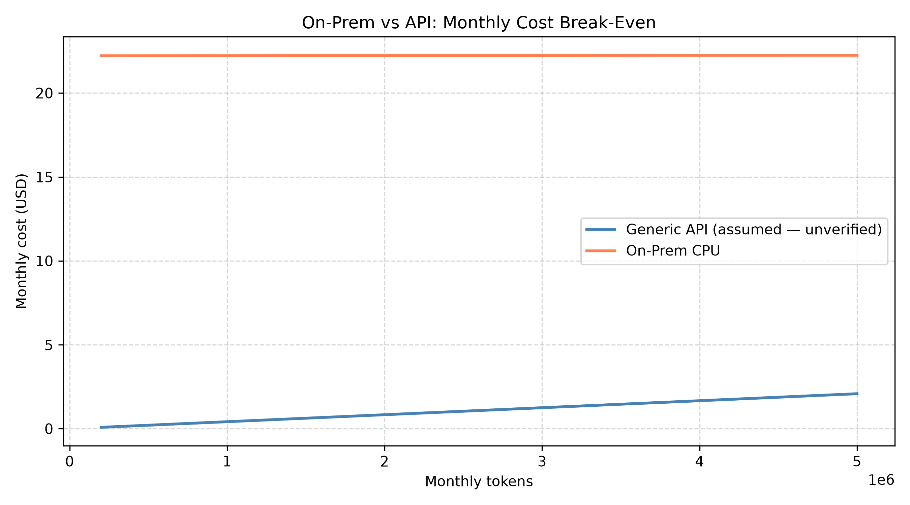

# salareen-ex05: Running a Massive LLM Locally

**AI Agents Architecture — Homework 05**
**Group:** salareen | **Students:** Saleh Hammam, Areen Tarabeh

> **Status:** Local Ollama benchmarks completed for qwen2.5:0.5b, qwen2.5:1.5b, and
> qwen2.5:3b. AirLLM was feasibility-checked but not executed. Economic analysis is
> assumption-based (API pricing not yet verified). See [§9 Limitations](#9-limitations)
> and [§10 Conclusions / Summary](#10-conclusions--summary) for the full picture.

---

## Table of Contents

1. [Project Overview](#1-project-overview)
2. [Hardware Summary](#2-hardware-summary)
3. [Model-Selection Strategy](#3-model-selection-strategy)
4. [Experiment Plan](#4-experiment-plan)
5. [Metrics Plan](#5-metrics-plan)
6. [Economic Analysis Plan](#6-economic-analysis-plan)
7. [Lecture Concepts Connection](#7-lecture-concepts-connection)
8. [Results](#8-results)
9. [Limitations](#9-limitations)
10. [Conclusions / Summary](#10-conclusions--summary)
11. [Project Structure](#11-project-structure)
12. [Setup Instructions](#12-setup-instructions)
13. [Running the Experiments](#13-running-the-experiments)
14. [References](#14-references)

---

## 1. Project Overview

This project investigates the practical feasibility of running a large language model (LLM) on
consumer-grade CPU-only hardware. The experiment chain is:

1. **Hardware audit** — detect and record the actual machine capabilities.
2. **Baseline inference** — attempt direct local inference with a small/medium model using
   `transformers` and measure raw latency and memory.
3. **Optimization** — apply quantization (GGUF/llama.cpp, or GPTQ/AWQ if supported) and/or
   AirLLM's layer-streaming technique to reduce peak memory and compare performance.
4. **Economic analysis** — compare the cost of local CPU inference against paid API access
   (Anthropic Claude, OpenAI GPT-4o) for typical workloads.
5. **Report** — draw conclusions about when on-prem inference is viable vs. when API is
   more cost-effective.

---

## 2. Hardware Summary

| Component | Detail |
|-----------|--------|
| CPU | Intel Core i7-8550U @ 1.80 GHz (Boost ~4.0 GHz) |
| Physical cores | 4 |
| Logical processors | 8 (Hyper-Threading) |
| RAM | ~16 GB DDR4 |
| RAM available at test start | ~6.8 GB |
| GPU | Intel UHD Graphics 620 (integrated) |
| GPU VRAM | ~1 GB shared system RAM |
| CUDA / NVIDIA | **Not available** (`nvidia-smi` not recognized) |
| Disk (C:) | ~511 GB total, ~22.5 GB free |
| OS | Windows 11 Home |

**Key constraint:** CPU-only inference. No CUDA, no discrete GPU. All tensor operations
run on the i7-8550U. Peak addressable RAM for a model is constrained to the free physical
RAM (~6.8 GB at start) minus OS overhead; larger models will require virtual memory/paging
or a layer-streaming strategy such as AirLLM.

---

## 3. Model-Selection Strategy

Because this is a CPU-only environment with ~6–8 GB usable RAM, model size must be
chosen carefully:

| Strategy | Candidate family | Notes |
|----------|-----------------|-------|
| FP16 baseline | Models ≤ 3B params (≤ ~6 GB FP16) | Likely fits in RAM; establishes baseline |
| INT8 quantization | Same model, 8-bit | Halves memory; tests quantization impact |
| GGUF / llama.cpp | Any GGUF-quantized model (Q4_K_M etc.) | CPU-optimized; best latency on CPU |
| AirLLM | Larger model (7B+) with layer streaming | Tests feasibility under disk paging |
| Fallback | Smaller GGUF model if 7B is too slow | Documented with justification |

Final model choice will be logged after the hardware detection script runs and confirms
available RAM. Candidate model families: Phi-3-mini, Qwen2-0.5B/1.5B, TinyLlama, Mistral-7B.

**Model choice justification (actual):** the Qwen2.5 family was selected for the
baselines in §8, for four concrete reasons:

1. **Same family across multiple sizes.** Qwen2.5 ships as 0.5B, 1.5B, and 3B variants,
   which lets us isolate the effect of *parameter count alone* on CPU throughput while
   holding model architecture, tokenizer, and runtime stack constant.
2. **Available directly through Ollama.** No manual GGUF conversion or Hugging Face
   token/download step was needed — `ollama pull qwen2.5:<size>` gives a working,
   already-quantized (Q4_K_M) local model in one step, which matched the "CPU-only,
   limited disk/RAM" constraint from §2.
3. **Ollama's quantized runtime is CPU-appropriate.** llama.cpp-based Q4_K_M inference is
   the CPU-optimized path called out in the strategy table above, so using it satisfies
   the "GGUF / llama.cpp" row without extra tooling.
4. **Larger candidates were deliberately avoided at this stage.** Mistral-7B (and other
   7B+ candidates) were not pulled or benchmarked, because this machine is CPU-only with
   no CUDA and limited free RAM (~6.8 GB at test start) — a 7B model's RAM/runtime
   requirements made it a poor first candidate; it is instead the subject of the AirLLM
   feasibility check in §8, rather than a direct benchmark.

---

## 4. Experiment Plan

### Phase A — Baseline
- Load a small model (FP16 / BF16) directly with `transformers`.
- Generate a fixed prompt (100-token output target).
- Record TTFT, TPOT, tokens/sec, peak RAM.

### Phase B — Quantization
- Apply INT8 quantization via `bitsandbytes` (if supported on CPU) **or** convert to GGUF
  and run via `llama-cpp-python`.
- Same prompt, same measurement harness.
- Compare delta vs. Phase A.

### Phase C — AirLLM
- Attempt AirLLM's `AutoModel` with `init_on_disk=True` on a 7B model.
- Measure layer-load overhead, peak RAM, total throughput.
- **Important hardware caveat:** On this CPU-only machine (no NVMe, ~6.8 GB free RAM,
  spinning or SATA SSD), AirLLM may be extremely slow (minutes per token) or fail
  entirely due to Windows disk-I/O bottlenecks during layer streaming.
  A carefully documented failure or fallback is a fully valid scientific outcome —
  it demonstrates *why* AirLLM requires fast NVMe storage and adequate RAM headroom,
  which is itself a core lesson of this assignment.
- If AirLLM is not feasible, fall back to the best GGUF result and analyze the failure.

### Phase D — Economic Analysis
- Assume a representative workload: 1 M tokens/month input, 200 K tokens/month output.
- Compute API cost (Anthropic Claude 3 Haiku, OpenAI GPT-4o-mini).
- Compute on-prem cost (electricity, hardware amortisation).
- Determine break-even point.

---

## 5. Metrics Plan

All metrics will be captured by `src/salareen_ex05/metrics.py`.

| Metric | Description | Unit |
|--------|-------------|------|
| TTFT | Time from prompt submission to first output token | seconds |
| TPOT | Average time between consecutive output tokens | seconds/token |
| Throughput | Output tokens generated per second | tokens/sec |
| Peak RAM | Maximum RSS during generation | MB |
| Total runtime | Wall-clock time for entire run | seconds |
| Output quality | Manual rating + perplexity proxy if available | qualitative |

---

## 6. Economic Analysis Plan

See `src/salareen_ex05/costs.py` for the computation model.

Assumptions (to be refined with real latency data):
- Hardware amortisation: 3-year straight-line depreciation on purchase price
- Electricity: ~0.12 USD/kWh, TDP ~15 W for i7-8550U under load
- API pricing: current public pricing at time of experiment
- Workload: 1 M input tokens + 200 K output tokens per month

Expected deliverable: break-even analysis table and chart showing at which monthly
token volume on-prem becomes cheaper than API.

---

## 7. Lecture Concepts Connection

This table was originally written as a plan (before any results existed); it is now
grounded in the actual measurements from §8 wherever a real number is available.

| Concept | Evidence from this project |
|---------|------------------------------|
| CPU vs GPU | All three Ollama baselines (§8) ran on a CPU-only machine (Intel i7-8550U, no CUDA); the AirLLM feasibility check (§8) independently confirmed `cuda_available: false` on the same hardware. |
| VRAM / RAM | No VRAM exists on this machine (integrated GPU only); system RAM (~7–8 GB free) is the binding constraint, which is exactly why the AirLLM feasibility check flagged this environment as risky for a 7B+ model. |
| Prefill vs Decode | Directly measured: qwen2.5:0.5b evaluated its 79-token prompt in ~108 ms (≈732 tok/s prefill) but decoded output at only ~26 tok/s; qwen2.5:3b evaluated the same 79-token prompt in ~2.94 s (≈27 tok/s prefill) and decoded at ~8.00 tok/s. Prefill is consistently faster and more parallelizable than the sequential decode step, at every model size tested. |
| Memory-bound vs Compute-bound | Throughput fell from ~25.99 → ~15.28 → ~8.00 tok/s as model size grew 0.5B → 1.5B → 3B (roughly halving each step) while decode logic stayed identical — consistent with a memory-bandwidth-bound workload, where cost scales with weight data moved per token rather than with compute complexity. |
| Virtual memory / paging / mmap | Discussed as AirLLM's core motivation (layer-by-layer mmap loading avoids full-model RAM allocation) but **not executed** — the AirLLM feasibility check (§8) stopped short of a real run, so paging/mmap behavior was not observed directly on this machine. |
| Quantization | Directly measured via `ollama show`: all three baselines use `quantization: Q4_K_M` (§8 "Ollama model metadata"), a ~4-bit GGUF scheme (~4x smaller than FP16). No Q4/Q8/FP16 comparison was run — see [Limitations](#9-limitations). |
| AirLLM | The feasibility check (§8) found `likely_compatible: No` (no CUDA, package not installed) **before** any large model was downloaded — the intended use case for a feasibility gate. |
| SafeTensors / GGUF | Every baseline used Ollama's GGUF-format Q4_K_M weights, the CPU-optimized format called out in §3; no SafeTensors/FP16 model was loaded in this project. |

---

## 8. Results

### Ollama model metadata

Metadata collected directly from `ollama show <model>` for the two models used in the
baselines below.

| Field | qwen2.5:0.5b | qwen2.5:1.5b |
|-------|--------------|--------------|
| Architecture | qwen2 | qwen2 |
| Parameters | 494.03M | 1.5B |
| Context length | 32768 | 32768 |
| Embedding length | 896 | 1536 |
| Quantization | Q4_K_M | Q4_K_M |
| License | Apache License 2.0 | Apache License 2.0 |

Raw command output saved in `results/ollama_show_qwen2_5_0_5b.txt`,
`results/ollama_show_qwen2_5_1_5b.txt`, and `results/ollama_models_list.txt`.

> **Quantization discussion:** all three Ollama models used in this project
> (qwen2.5:0.5b, qwen2.5:1.5b, qwen2.5:3b) are pulled from the Ollama library
> **already quantized** — `ollama show qwen2.5:1.5b` reports `quantization: Q4_K_M`,
> and the same quantization applies to the other two. This means every baseline
> recorded in this section is **not** full-precision FP16 inference; it already
> benefits from 4-bit quantization applied by Ollama/GGUF at model-pull time.
>
> **What Q4_K_M means, briefly:** GGUF's `Q4_K_M` scheme stores most weights at ~4 bits
> per parameter (with some higher-precision "K" blocks mixed in for the most sensitive
> tensors), versus 16 bits per parameter for FP16. That is roughly a **4x reduction in
> raw weight memory**, which is the main reason a 1.5B-parameter model can run
> comfortably on a machine with only ~7 GB of free RAM. The expected tradeoff is a small
> loss of numerical precision — and therefore potential output-quality degradation —
> compared to the original FP16 weights, though this project did not measure that
> degradation directly (see [Limitations](#9-limitations)).
>
> **What this project did *not* do:** it did not run a controlled Q4 vs. Q8 vs. FP16
> comparison on the same model. All cross-model numbers in §8 compare **different
> parameter counts at the same fixed quantization level (Q4_K_M)** — they isolate the
> effect of model size on CPU throughput, not the effect of quantization level itself.
> A true FP16 baseline (Phase A in §4) has not been run; the numbers below should be
> read as "quantized CPU inference at varying model size," not as an FP16 reference
> point or a quantization-level ablation.

> **Process memory note:** A single point-in-time snapshot of the `ollama` server
> process (`Get-Process ollama`) recorded a working set (WS) of about 62,029,824 bytes
> (~62 MB) and a private memory (PM) of about 83,738,624 bytes (~84 MB); see
> `results/ollama_process_memory_snapshot.txt`. This is only a snapshot of the Ollama
> process at one moment — it does **not** represent the full model-memory footprint
> during active generation, and no continuous/peak memory tracking has been done yet.
> More precise, time-resolved memory profiling (e.g. sampling WS/PM throughout a
> generation run) is still needed in a later phase.

---

### Baseline 1: Ollama — qwen2.5:0.5b (CPU-only)

First real inference result collected on the target hardware using the Ollama HTTP API
(`http://localhost:11434/api/generate`), model `qwen2.5:0.5b`, with the fixed benchmark
prompt stored in `data/prompts/ollama_benchmark_prompt.txt`.

| Metric | Value |
|--------|-------|
| Model | qwen2.5:0.5b (0.5B parameters) |
| Total wall-clock runtime | 17.31 s |
| Prompt tokens (prompt_eval_count) | 79 |
| Prompt eval duration | 107,959,000 ns (≈ 108 ms) |
| Output tokens (eval_count) | 270 |
| Eval (decode) duration | 10,389,355,000 ns (≈ 10.39 s) |
| **Throughput** | **25.99 tokens/sec** |
| Process RSS before (script only) | 38.44 MB |
| Process RSS after (script only) | 39.97 MB |
| Process RSS delta | 1.53 MB |

> **RAM note:** The RSS values above reflect only the benchmark script process.
> The Ollama server and model weights run in a separate process; total system
> memory for the model should be measured from the Ollama process directly
> (planned for a later phase).


#### Interpretation

- **Local CPU-only inference is feasible for a very small 0.5B model.** At ~26 tokens/sec
  the output is readable in near real-time on consumer hardware with no GPU.
- **This is a functional baseline, not a proof that larger models will work.** qwen2.5:0.5b
  is far smaller than the "massive LLM" target of this experiment; a 7B model would require
  roughly 14× more memory and would be correspondingly slower on CPU.
- **Prefill vs. decode split is visible:** the 79 prompt tokens were evaluated in ~108 ms
  (≈ 732 tokens/sec — fast, parallelisable prefill), while the 270 decode tokens took
  ~10.4 s total (≈ 26 tokens/sec — slow, sequential decode). This directly illustrates the
  prefill/decode asymmetry discussed in the lecture.
- **Next phases** will apply quantization, attempt AirLLM layer-streaming on a larger
  model, and produce an economic break-even analysis.

---

### Baseline 2: Ollama — qwen2.5:1.5b (CPU-only)

Second inference result, same hardware, same fixed prompt, model scaled up to 1.5B parameters.

| Metric | Value |
|--------|-------|
| Model | qwen2.5:1.5b (1.5B parameters) |
| Total wall-clock runtime | 26.77 s |
| Prompt tokens (prompt_eval_count) | 79 |
| Prompt eval duration | 1,446,900,000 ns (≈ 1.45 s) |
| Output tokens (eval_count) | 295 |
| Eval (decode) duration | 19,308,239,000 ns (≈ 19.31 s) |
| **Throughput** | **15.28 tokens/sec** |
| Process RSS before (script only) | 38.30 MB |
| Process RSS after (script only) | 39.43 MB |
| Process RSS delta | 1.13 MB |

> **RAM note:** RSS values reflect the benchmark script process only, not the Ollama
> server or model weights. System-level Ollama memory measurement is planned for a
> later phase.


---

### Baseline 3: Ollama — qwen2.5:3b (CPU-only)

Third inference result, same hardware, same fixed prompt, model scaled up to 3B
parameters as a heavier local stress test.

| Metric | Value |
|--------|-------|
| Model | qwen2.5:3b (3B parameters) |
| Total wall-clock runtime | 32.21 s |
| Prompt tokens (prompt_eval_count) | 79 |
| Prompt eval duration | 2,938,253,000 ns (≈ 2.94 s) |
| Output tokens (eval_count) | 183 |
| Eval (decode) duration | 22,868,450,000 ns (≈ 22.87 s) |
| **Throughput** | **8.00 tokens/sec** |
| Process RSS before (script only) | 37.45 MB |
| Process RSS after (script only) | 38.53 MB |
| Process RSS delta | 1.08 MB |

> **RAM note:** As with the previous two baselines, these RSS values are process-level
> figures captured by the benchmark wrapper, not the Ollama server/model footprint.
> Full system-level memory profiling of the Ollama process during generation is still
> pending.



---

### Cross-model Comparison

| Model | Runtime (s) | Prompt tokens | Output tokens | Throughput (tok/s) | Script RSS delta (MB) |
|-------|-------------|---------------|---------------|--------------------|-----------------------|
| qwen2.5:0.5b | 17.31 | 79 | 270 | **25.99** | 1.53 |
| qwen2.5:1.5b | 26.77 | 79 | 295 | **15.28** | 1.13 |
| qwen2.5:3b | 32.21 | 79 | 183 | **8.00** | 1.08 |
| Throughput ratio | — | — | — | 0.59× (1.5b / 0.5b), 0.52× (3b / 1.5b) | — |

#### Analysis

- **Throughput drops from ~25.99 to ~15.28 to ~8.00 tok/s** as model size scales
  0.5B → 1.5B → 3B. Each step down is roughly a halving, consistent with a
  memory-bandwidth-bound workload where decode cost scales with the amount of weight
  data streamed through the CPU cache per token.
- **Runtime increases from ~17.31 s to ~26.77 s to ~32.21 s** across the same three
  models, even though the 3B run produced fewer output tokens (183 vs. 270/295) —
  the added per-token latency outweighs the shorter output.
- **This supports the expected CPU-only bottleneck trend:** larger models require
  proportionally more computation and memory movement per decode step, with no GPU to
  absorb the extra bandwidth demand.
- **qwen2.5:3b is still not a "massive LLM"** by the standard of this assignment, but
  at 8 tok/s it is already a useful local stress test on this hardware — it marks the
  practical edge of comfortable interactive use before the next scale jump (7B+).
- **Script-level RSS deltas remain small and similar across all three runs** (~1.0–1.5
  MB), confirming the benchmark wrapper itself has negligible overhead; the real model
  memory footprint lives in the Ollama server process and is not yet measured here.
- **Next phase** should move toward AirLLM / a documented fallback for a larger model,
  and a more explicit quantization / system-level memory discussion, rather than
  further small-model CPU scaling points.

---

### AirLLM feasibility check (not executed)

**AirLLM was not executed in this project.** Before attempting to download any 7B+
model for AirLLM, a lightweight, non-destructive feasibility check was implemented
instead (`src/salareen_ex05/airllm_feasibility.py`,
`uv run python -m salareen_ex05.main airllm-check`). It inspects the current
environment — Python version, OS, CUDA availability, whether the `airllm` package is
importable, RAM/disk headroom — and writes an honest report. **It does not install
AirLLM, download any model, or run inference.**

Real result from this machine, saved to `results/airllm_feasibility_report.txt` /
`.json`:

| Field | Value |
|-------|-------|
| Python | 3.12.13 |
| Platform | Windows-11-10.0.26200-SP0 (CPU-only) |
| CUDA available | **No** |
| AirLLM importable | **No** (not installed) |
| RAM total / available | 15.9 GB / ~7–8 GB (fluctuates run to run) |
| Disk free | 199.6 GB |
| Likely compatible for a real AirLLM run | **No** |

**Summary:** on this Windows, CPU-only machine — no CUDA GPU and the `airllm` package
not installed/importable — the feasibility check's own verdict is
`likely_compatible = No`. AirLLM's layer-streaming / disk-offload approach is designed
primarily around GPU VRAM constraints, which this machine simply doesn't have.

**This is an engineering finding, not a project failure.** Neither "no CUDA" nor
"package not installed" is a defect in the project — they are exactly the kind of
result a feasibility check exists to surface *before* spending time/disk downloading a
multi-gigabyte model that was unlikely to run well. This confirms, with real
measurements, the caveat already predicted in
[§4 Phase C](#4-experiment-plan): "On this CPU-only machine (no NVMe, ~6.8 GB free RAM,
spinning or SATA SSD), AirLLM may be extremely slow ... or fail entirely." The
feasibility check turns that prediction into a documented, reproducible result instead
of leaving it as an assumption. The Ollama GGUF/Q4_K_M results above (§8 Baselines
1–3) remain the CPU-only fallback baseline used in place of a real AirLLM run.

**Next step, if pursued:** install `airllm` deliberately (e.g. `uv add airllm`) and
re-run `airllm-check` — only after that check looks reasonable would a small,
deliberate model be attempted, rather than downloading a 7B model up front.

---

### Economic Analysis — Assumption-Based Draft

Implemented in `src/salareen_ex05/costs.py` (+ CLI wiring in
`src/salareen_ex05/economic_cli.py`), run via
`uv run python -m salareen_ex05.main costs`. **No external API is called** — every
price below is a configurable default the caller can override with CLI flags.

> **⚠️ Pricing has not been verified.** The API input/output prices are placeholder
> assumptions, not current pricing pulled from any provider. Do not treat this
> analysis as final until the prices are checked against the provider's live pricing
> page and updated via CLI flags.

**Assumptions (defaults, all overridable via CLI flags):**

| Assumption | Default | Flag |
|------------|---------|------|
| API input price | $0.25 / 1M tokens *(unverified)* | `--api-input-price-per-m` |
| API output price | $1.25 / 1M tokens *(unverified)* | `--api-output-price-per-m` |
| On-prem hardware price | $800.00 | `--hardware-price` |
| Amortization period | 3 years | `--amortization-years` |
| Electricity cost | $0.12 / kWh | `--electricity-cost-per-kwh` |
| Average CPU power under load | 15 W (i7-8550U estimate) | `--avg-power-watts` |
| On-prem throughput | 15.28 tok/s *(measured, qwen2.5:1.5b baseline)* | `--tokens-per-sec` |

**API monthly cost formula:**
`api_cost = (input_tokens / 1e6) × input_price_per_m + (output_tokens / 1e6) × output_price_per_m`

**On-Prem monthly cost formula:**
`onprem_cost = (hardware_price / (amortization_years × 12)) + ((avg_power_watts / 1000) × inference_hours × electricity_cost_per_kwh)`
where `inference_hours = (output_tokens / tokens_per_sec) / 3600`.

**Generated draft result** (default workload: 1,000,000 input + 200,000 output
tokens/month), saved to `results/economic_analysis.json` / `.csv` and
`figures/economic_break_even.png`:

| Method | Monthly cost (USD) | USD / 1k tokens |
|--------|--------------------|------------------|
| Generic API (assumed pricing) | $0.50 | $0.0004 |
| On-Prem CPU | $22.23 | $0.1111 |

Break-even (assumed pricing): ~53,998,334 total tokens/month.



**Interpretation (draft, assumption-dependent):** at this default workload and these
placeholder prices, the assumed API is far cheaper — on-prem cost is dominated by
hardware amortization ($22.22/mo of the $22.23 total), not electricity ($0.0065/mo),
because the workload is small relative to a fixed monthly hardware charge. The
break-even point (~54M tokens/month) is driven almost entirely by how low the assumed
API price is; if the real API price is higher, on-prem becomes competitive at a much
lower volume. **This conclusion will change once real, verified API pricing is used**
— it should not be read as a claim that on-prem CPU inference is uneconomical in
general.

---

## 9. Limitations

These limitations apply to every result in §8 and should be read alongside them —
they are not disclaimers about hypothetical problems, but a direct account of what
was and wasn't measured.

- **RAM measurements are process-level, not full model memory.** The RSS values in
  the Ollama baselines reflect the benchmark *script* process, and the single
  Ollama-process snapshot (~62 MB WS) is a point-in-time sample — neither is a
  continuous or peak measurement of the Ollama server's actual model-memory
  footprint during generation.
- **API prices in the economic analysis are assumption-based and unverified.** The
  $0.25/$1.25 per-1M-token defaults are configurable placeholders, not pricing
  checked against any provider's live pricing page. The economic analysis must not
  be treated as final until real prices are substituted.
- **AirLLM was feasibility-checked only, not executed.** No AirLLM install, model
  download, or inference run occurred in this project; the "No / likely
  incompatible" result comes entirely from a static environment audit.
- **All Ollama benchmarks use quantized (Q4_K_M) models, not an FP16 baseline.** No
  full-precision run was performed on this hardware, so the throughput numbers in
  §8 cannot be directly compared to an FP16 reference point.
- **No Q4 vs. Q8 vs. FP16 quantization-level comparison was performed.** Every
  cross-model comparison in §8 varies parameter count at a single fixed
  quantization level; the effect of quantization level itself was not isolated.
- **Output quality was not deeply evaluated.** Beyond confirming that each model
  produced a coherent, on-topic response to the fixed benchmark prompt, no
  systematic quality scoring (human rating, perplexity, or otherwise) was applied.

---

## 10. Conclusions / Summary

CPU-only local inference is feasible for small, already-quantized models: qwen2.5:0.5b,
1.5b, and 3b all ran successfully on this Windows laptop with no GPU. Throughput
decreased predictably as model size increased — ~25.99 tok/s (0.5B) → ~15.28 tok/s
(1.5B) → ~8.00 tok/s (3B) — which matches the memory-bandwidth-bound bottleneck
expected on CPU-only hardware (§7). AirLLM itself was not executed: its own feasibility
check reported this environment as `likely_compatible: No` (no CUDA GPU, `airllm`
package not installed), so a 7B+ model was never downloaded, and the Ollama Q4_K_M
baselines served as the practical fallback instead. The economic analysis is a useful,
fully configurable comparison tool, but every dollar figure it currently produces rests
on unverified placeholder API pricing and must not be read as a final on-prem-vs-API
verdict. Taken together, the project's central finding is that local CPU inference is
genuinely usable at small model sizes, but for larger or more reliability-sensitive
workloads, either a paid API or actual GPU hardware remains the more practical choice
on this class of machine.

---

## 11. Project Structure

```
salareen-ex05/
├── README.md                  # This file — project guide + technical report
├── pyproject.toml             # Project metadata & dependencies (uv)
├── .env-example                # Environment variable template
├── docs/
│   ├── PRD.md                 # Product Requirements Document
│   ├── PLAN.md                # Technical architecture & experiment plan
│   ├── TODO.md                # Phase-by-phase task tracker
│   └── PROMPT_LOG.md          # Log of all AI prompts used
├── src/
│   └── salareen_ex05/
│       ├── __init__.py
│       ├── hardware.py            # Hardware detection utilities
│       ├── metrics.py             # Timing & memory measurement harness
│       ├── ollama_benchmark.py    # Ollama HTTP API benchmark runner
│       ├── airllm_feasibility.py  # AirLLM environment feasibility check (no download)
│       ├── costs.py               # On-prem vs API economic model (assumption-based)
│       ├── economic_cli.py        # CLI orchestration for the `costs` command
│       ├── plots.py               # Matplotlib chart generators
│       └── main.py                # CLI entry point (typer)
├── experiments/               # Experiment runner scripts
├── results/                   # Raw JSON/CSV/TXT results (hardware, Ollama, AirLLM, economic)
├── reports/                   # Generated PDF/HTML reports
├── figures/                   # Saved chart images (benchmarks + economic break-even)
├── data/
│   └── prompts/                   # Fixed benchmark prompt(s)
├── scripts/                   # One-off helper scripts
└── tests/
    ├── __init__.py
    ├── conftest.py
    ├── test_project_structure.py
    ├── test_metrics.py
    ├── test_ollama_benchmark.py
    ├── test_airllm_feasibility.py
    ├── test_costs.py
    └── test_plots.py
```

---

## 12. Setup Instructions

### Prerequisites
- Windows 11, Python 3.11 (recommended), `uv` installed globally
- At least 8 GB free disk space for model weights

### Steps

```powershell
# 1. Clone the repository (already done if you're reading this)
git clone https://github.com/SalehHammam25/salareen-ex05.git
cd salareen-ex05

# 2. Install uv (if not already installed)
powershell -ExecutionPolicy ByPass -c "irm https://astral.sh/uv/install.ps1 | iex"

# 3. Create virtual environment and install all dependencies in one step
uv sync

# 4. Copy environment template
copy .env-example .env
# Edit .env if needed (Hugging Face token for gated models, etc.)

# 5. Verify setup — uv run uses the managed venv automatically
uv run python -m salareen_ex05.main --help
```

---

## 13. Running the Experiments

```powershell
# Hardware detection
uv run python -m salareen_ex05.main hardware

# Ollama benchmark (requires Ollama running with qwen2.5:0.5b pulled)
uv run python -m salareen_ex05.main ollama-benchmark --model qwen2.5:0.5b --runs 1

# Multiple runs for stable averages
uv run python -m salareen_ex05.main ollama-benchmark --model qwen2.5:0.5b --runs 3

# Baseline inference (model TBD after hardware check)
uv run python -m salareen_ex05.main run baseline --model <model-id> --max-tokens 100

# Quantized inference
uv run python -m salareen_ex05.main run gguf --model <model-id>

# AirLLM inference
uv run python -m salareen_ex05.main run airllm --model <model-id>

# Economic analysis
uv run python -m salareen_ex05.main costs --monthly-input-tokens 1000000 --monthly-output-tokens 200000

# Generate benchmark summary chart from a CSV results file
uv run python -m salareen_ex05.main plots --results-file results/ollama_benchmark_qwen2_5_0_5b.csv

# Also works with JSON
uv run python -m salareen_ex05.main plots --results-file results/ollama_benchmark_qwen2_5_0_5b.json
```

---

## 14. References

- AirLLM GitHub: https://github.com/lyogavin/airllm
- llama.cpp: https://github.com/ggerganov/llama.cpp
- Hugging Face `transformers`: https://huggingface.co/docs/transformers
- `llama-cpp-python`: https://github.com/abetlen/llama-cpp-python
- Anthropic Claude pricing: https://www.anthropic.com/pricing
- OpenAI pricing: https://openai.com/pricing
